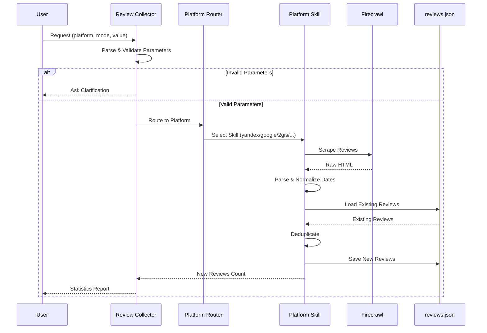

# Review Collector Agent - Sequence Diagram

```mermaid
sequenceDiagram
    participant User
    participant Agent as Review Collector
    participant Router as Platform Router
    participant Skill as Platform Skill
    participant Firecrawl
    participant Data as reviews.json

    User->>Agent: Request (platform, mode, value)
    Agent->>Agent: Parse & Validate Parameters
    
    alt Invalid Parameters
        Agent-->>User: Ask Clarification
    else Valid Parameters
        Agent->>Router: Route to Platform
        Router->>Skill: Select Skill (yandex/google/2gis/...)
        Skill->>Firecrawl: Scrape Reviews
        Firecrawl-->>Skill: Raw HTML
        Skill->>Skill: Parse & Normalize Dates
        Skill->>Data: Load Existing Reviews
        Data-->>Skill: Existing Reviews
        Skill->>Skill: Deduplicate
        Skill->>Data: Save New Reviews
        Skill-->>Agent: New Reviews Count
        Agent-->>User: Statistics Report
    end
```
