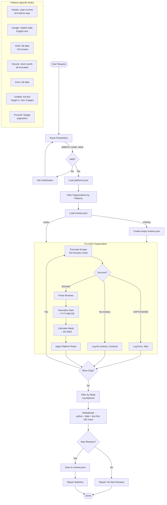

# Review Collector Agent Workflow

## Flow Description

### 1. Parse Parameters
Извлекает из запроса:
- `platform`: yandex, google, 2gis, otzovik, zoon, ucheba, proverili, all
- `mode`: count или period
- `value`: 3/5/10 или 24h/48h/1w

### 2. Load Data
- Загружает `data/platforms.json` — список организаций
- Загружает `data/reviews.json` — существующие отзывы для дедупликации

### 3. Scrape Loop
Для каждой организации:
- Firecrawl scrape БЕЗ browser-mode
- Обработка ошибок (CAPTCHA, 404, нет отзывов)
- Парсинг отзывов с нормализацией даты

### 4. Filter & Deduplicate
- Фильтрация по mode/value
- Удаление дубликатов по ключу `author + date + text[:100]`

### 5. Save & Report
- Сохранение в `data/reviews.json`
- Отчёт со статистикой
